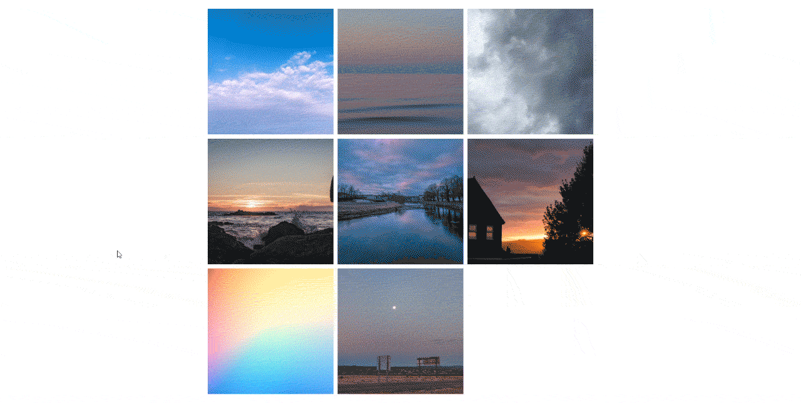

# Simple Image Lightbox Gallery
This is a simple and basic lightbox implementation for an image gallery using JavaScript, CSS and HTML. Feel free to alter as you wish!

### How to Use
Simply, use this format within your html file
```html
<div class="grid">
    
    ... ...
    
</div>
```
and include the respective links to the JS and CSS files in your HTML file
```html
<link rel="stylesheet" href="style.css">
<script defer src="script.js"></script>
```
All images you want to apprear in your gallery, place within the class 'grid' div.

----
### Lightbox image different?
If the image you want to appear in the lightbox is different to the image in the `src`, add a `data-src` attribute, like so:
```html

```
Now when you click on an image in your gallery, the image located in your `data-src` will apprear. If there is no `data-src`, this will default to using the `src` image.

----
### Examples
See `index.html`.

#### Demo using `src`

Image in the lightbox is the exact same as the images in the gallery

#### Demo using `src` and `data-src`

Image in the lightbox is different from the ones in the gallery. They may also be different dimensions to represent a bigger image.